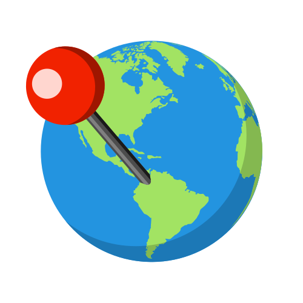

# Geo Tracker
<p align="center">
  
</p>

## Descripción
Geo Tracker es una aplicación que permite visualizar la mejor ruta entre un origen y destino. Se siguen los siguientes pasos:
1. Se elige la ciudad deseada a examinar: Medellín o Envigado.
2. Se selecciona el tipo de transporte a utilizar: Carro, Bicicleta o Caminando.
3. Se ingresa la dirección de origen y destino.
4. Click al botón "Iniciar" para visualizar la mejor ruta.

## Ejecución en desarrollo
1. Clonar el repositorio.
2. Moverse a la carpeta del proyecto.
```
cd front_maps_IA1
```
3. Instalar las dependencias con:
```
yarn 
npm install
```
3. Ejecutar la aplicación con:
```
yarn dev
npm run dev
```

## Stack Tecnológico
- Frontend: ReactJS

